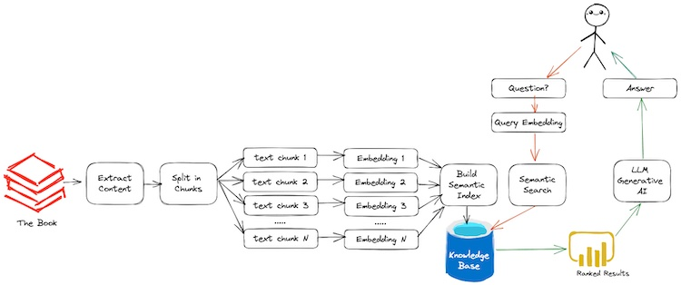

Referred https://github.com/alejandro-ao/langchain-ask-pdf or https://www.youtube.com/watch?v=wUAUdEw5oxM

**ENV SETUP**
1) pip install langchain langchain-community pypdf2 python-dotenv streamlit openai tiktoken langchain_openai
2) Setup Open AI API_KEY

**NOTES:**
1) Use streamlit to build UI
2) Read the PDF using PyPDF
3) Extract text from the PDF
4) Since the size of text will be too long, split the text into similar sized chunks. 
    Refer https://bennycheung.github.io/ask-a-book-questions-with-langchain-openai
    
5) Convert the chunks into embeddings. Embeddings are vector representation of text. A list of numbers that contains meaning of text. Convert the embeddings in to an object on which we will be able to search using FAISS.
6) FAISS or Facebook AI Similarity Search (Faiss) is a library for efficient similarity search and clustering of dense vectors. It contains algorithms that search in sets of vectors of any size, up to ones that possibly do not fit in RAM. It also contains supporting code for evaluation and parameter tuning. \n [Read More at https://python.langchain.com/v0.2/docs/integrations/vectorstores/faiss/]
7) Store the vectors in knowledge base 
8) When users asks questions, the question also needs to be embedded using the same technique used to embed the text chunks 
9) This allows to perform semantic search which will find the vector in knowledge base which are similar to the vector of the question 
10) These chunks will be fed to the language model and eventually get answer.

**COMMAND:**
streamlit run app.py